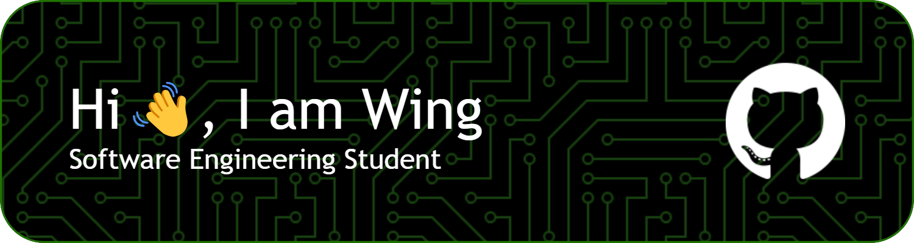

  

 

- 🔭 I’m currently studying at [Hive Helsinki](https://www.hive.fi/en/), a [42 coding school](https://42.fr/en/homepage/).
- 🌱 I’m learning full stack development, game development and C++.
- 🏢 I'm open to opportunities as an intern or junior software developer.
- 📫 How to reach me: **wengcychan95@gmail.com**

 

## 🚀 Projects

- **School Projects**  
[42cursus @ Hive Helsinki](https://github.com/wengcychan/hive-42cursus.git) : &nbsp; Projects developed at Hive Helsinki

- **Online Course Projects**  
[Full Stack Open 2023](https://github.com/wengcychan/fullstackopen.git) : &nbsp; Projects from Full Stack Open online course offered by the University of Helsinki

- **Side Projects**  
[GreenBin](https://github.com/wengcychan/greenbin.git) : &nbsp; An innovative waste management system incentivizing waste sorting  
[Community360](https://github.com/wengcychan/community360.git) : &nbsp; A city planning platform for public engagement developed by Unity

 

## 🛠️ Skills

- Languages

  
  
  
  

- Web Development

  
  
  
  
  
  
  
  

- Gaming

  

- Version Control

  
  

- Design

  
  
  
  

 

## ⚙️ GitHub Stats

